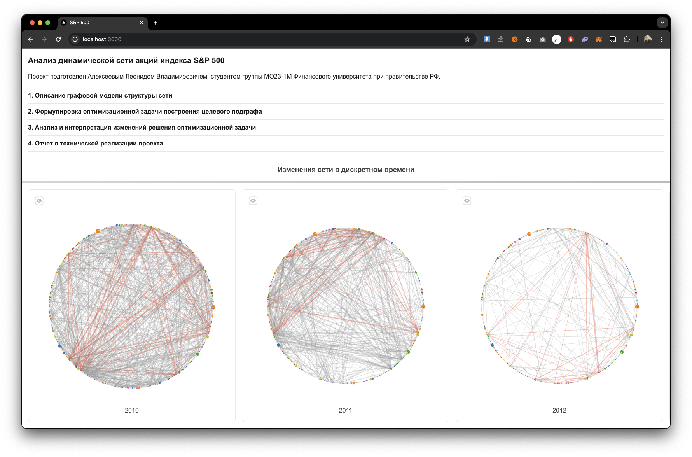

## Анализ динамической сети акций индекса S&P 500

Проект подготовлен Алексеевым Леонидом Владимировичем, студентом группы МО23-1М Финансового университета при правительстве РФ.

## Демонстрация проекта

**Ссылка на проект:**

[https://sp500-d3-graph.vercel.app/](https://sp500-d3-graph.vercel.app/)

**Скриншот сайта:**

## Отчет о технической реализации проекта

**1. Введение**

Данный проект посвящен анализу динамики корреляций между акциями, входящими в индекс S&P 500, с использованием графовых моделей. Целью проекта является визуализация и анализ изменений в структуре корреляций акций на протяжении времени (с 2010 по 2024 год) посредством выделения максимальных клик в графах корреляций за каждый год.

**2. Технологии и инструменты**

*   **Данные:**
    *   Датасет: Использован датасет исторических данных по акциям S&P 500, доступный на Kaggle `andrewmvd/sp-500-stocks`.
    *   Формат данных: CSV-файлы с ценами акций за каждый год.
*   **Библиотеки Python:**
    *   `pandas`: Для обработки и анализа данных, загрузки данных из CSV-файлов.
    *   `numpy`: Для математических вычислений, в частности, для расчета корреляционных матриц.
    *   `networkx`: Для построения и анализа графов, включая поиск максимальных клик.
*   **Фронтенд:**
    *   `React`: Для создания пользовательского интерфейса.
    *   `Next.js`: Фреймворк React для серверного рендеринга и маршрутизации.
    *   `d3.js`: Библиотека для визуализации данных, в частности, для отображения графов.
*   **Развертывание:**
    *   `Vercel`: Платформа для развертывания веб-приложений.

**3. Этапы реализации**

1.  **Сбор и подготовка данных:**
    *   Загрузка исторических данных по акциям S&P 500 из датасета Kaggle.
    *   Обработка данных:
        *   Фильтрация данных для каждого года с 2010 по 2024.
        *   Расчет корреляционных матриц между акциями за каждый год.
        *   Создание графов корреляций: ребро между двумя акциями добавляется, если их корреляция превышает заданный порог (например, 0.7).
2.  **Построение и анализ графов:**
    *   Использование `networkx` для создания графов корреляций для каждого года.
    *   Реализация алгоритма поиска максимальной клики в каждом графе.
    *   Расчет характеристик максимальных клик: количество узлов, количество ребер, плотность графа, количество компонент связности, степени узлов.
3.  **Фронтенд разработка:**
    *   Создание React-приложения с использованием Next.js.
    *   Разработка компонентов для визуализации графов с использованием `d3.js`.
    *   Реализация интерактивности: возможность выбора года для просмотра соответствующего графа и его характеристик.
4.  **Развертывание:**
    *   Деплой приложения на платформу Vercel.

**4. Оптимизационная задача**

*   **Задача:** Найти максимальную клику в каждом графе корреляций акций за каждый год.
*   **Целевая функция:** Максимизировать количество вершин в клике.
*   **Алгоритм:** Использован встроенный в `networkx` алгоритм поиска максимальной клики.

**5. Визуализация**

*   Визуализация графов корреляций с использованием `d3.js`.
*   Минимизация пересечений ребер при визуализации.
*   Отображение максимальной клики в каждом графе.
*   Отображение характеристик максимальной клики (количество узлов, ребер, плотность и т.д.).

**6. Результаты**

*   Получены максимальные клики для каждого года с 2010 по 2024.
*   Проведен качественный и количественный анализ изменений размеров клик и их характеристик.
*   Сделана интерпретация результатов с учетом экономических циклов и кризисных периодов.

**7. Заключение**

Данный проект успешно демонстрирует применение графовых моделей и алгоритмов оптимизации для анализа динамики корреляций на рынке акций S&P 500. Использование библиотеки `networkx` позволило эффективно построить и проанализировать графы корреляций, а алгоритм поиска максимальной клики выделил группы наиболее взаимосвязанных активов. Визуализация результатов с помощью `d3.js` в React-приложении, развернутом на `Vercel`, обеспечивает наглядное представление динамики изменений в структуре рынка. Проведенный анализ позволил выявить периоды высокой и низкой корреляции, а также связать эти изменения с экономическими циклами и кризисными явлениями, что подчеркивает практическую ценность разработанного подхода для финансового анализа и управления рисками.